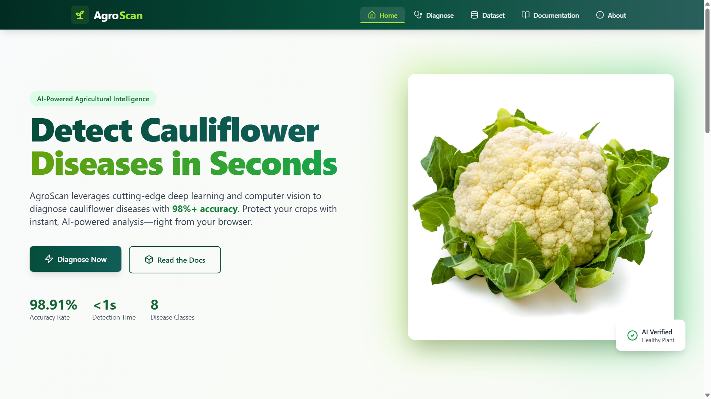
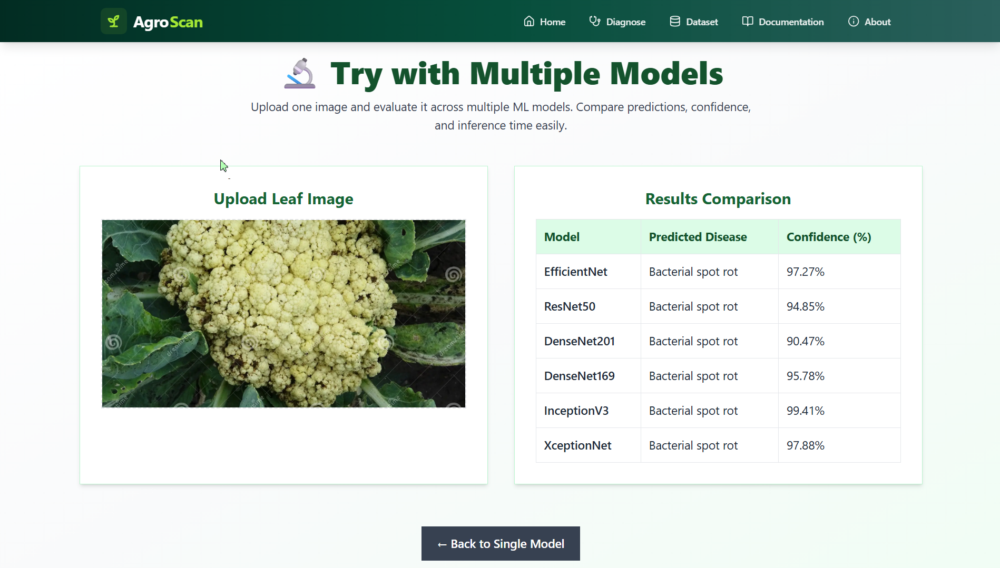

# Cauliflower Disease Classification

A machine learning application for detecting and classifying diseases in cauliflower leaves using deep neural networks. The system provides both a Python FastAPI backend and a React frontend for image-based disease diagnosis.



## Project Overview

This project implements a multi-model disease classification system supporting the following disease categories:
- Alternaria Leaf Spot
- Bacterial Spot Rot
- Black Rot
- Cabbage Aphid Colony
- Downy Mildew
- No Disease
- Club Root
- Ring Spot

The backend offers multiple pre-trained deep learning models for inference, allowing users to choose their preferred model for predictions.

## Project Structure

```
Cauliflower_Disease_Classification/
├── backend/                              # Python FastAPI backend
│   ├── main.py                          # FastAPI application and inference logic
│   ├── requirements.txt                 # Python dependencies
│   ├── *.h5                             # Pre-trained Keras/TensorFlow models
│   └── class_indices.json               # Class mapping
├── cauliflower-disease-classifier/      # React + Vite frontend
│   ├── src/
│   │   ├── pages/                       # Application pages
│   │   ├── components/                  # Reusable React components
│   │   └── App.jsx                      # Main React component
│   ├── package.json                     # Node.js dependencies
│   └── vite.config.js                   # Vite build configuration
└── README.md                             # This file
```

## Backend

### Technology Stack
- Python 3.10
- FastAPI (web framework)
- TensorFlow 2.17.1 (deep learning)
- Keras (model loading)
- Pillow (image processing)
- Uvicorn (ASGI server)

### Supported Models
1. EfficientNet - Input: 224x224
2. ResNet50 - Input: 224x224
3. DenseNet201 - Input: 224x224
4. DenseNet169 - Input: 224x224
5. InceptionV3 - Input: 299x299
6. XceptionNet - Input: 224x224



### Setup and Installation

1. Create and activate virtual environment:
   ```bash
   cd backend
   python -m venv venv
   .\venv\Scripts\Activate.ps1  # Windows PowerShell
   # or
   source venv/bin/activate     # macOS/Linux
   ```

2. Install dependencies:
   ```bash
   pip install --upgrade pip setuptools wheel
   pip install -r requirements.txt
   ```

3. Run the server:
   ```bash
   python -m uvicorn main:app --reload
   ```

The API will be available at `http://localhost:8000`

## Frontend

### Technology Stack
- React 18
- Vite (build tool)
- JavaScript (ES6+)

### Setup and Installation

1. Install dependencies:
   ```bash
   cd cauliflower-disease-classifier
   npm install
   ```

2. Run development server:
   ```bash
   npm run dev
   ```

The frontend will be available at `http://localhost:5173`

3. Build for production:
   ```bash
   npm run build
   ```

### Features
- Image upload interface
- Real-time disease prediction
- Multi-model comparison
- Disease information display
- Responsive design

## License

Specify your license here.

## Contact

For questions or issues, contact the project maintainer.
